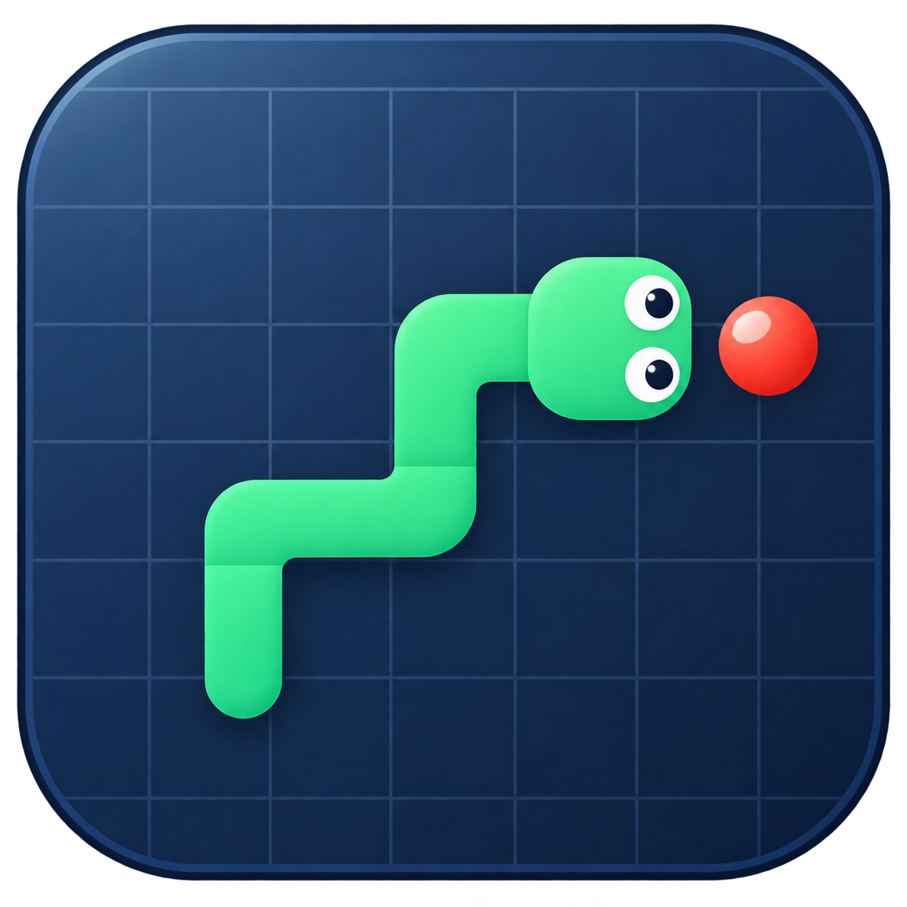
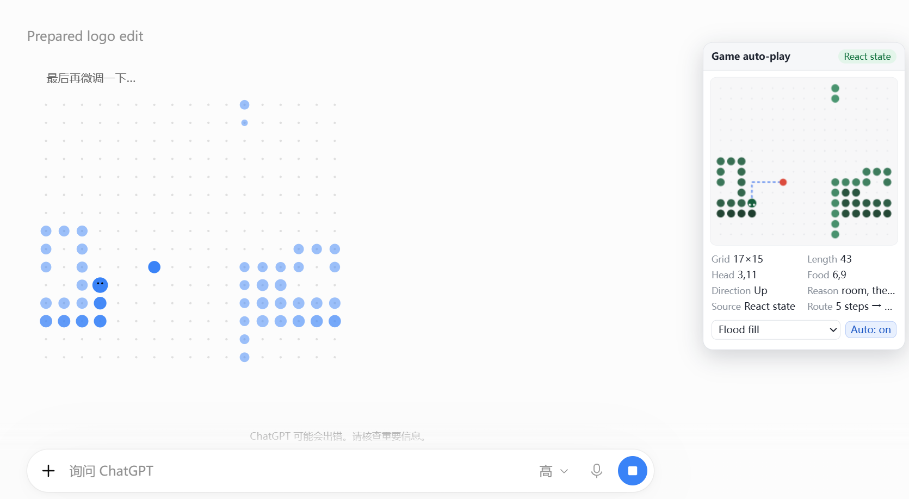

<p align="center"></p>

# ChatGPT Game Autoplay（ChatGPT 游戏自动游玩）

[English](README.md) · **中文**

ChatGPT 生成图片时会在等待页面上放一个贪吃蛇小游戏。**ChatGPT Game Autoplay 帮你自动玩**：它认出真正的棋盘，按你选的策略操作蛇，并在页面右侧留一个实时面板，让你看得见它在想什么。

一切都在你自己的浏览器里完成：扩展只读它已经打开的那个页面，不会把任何数据发出去。



*扩展在真实的出图页面上的样子：左边是它正在玩的游戏，右侧是实时面板。*

## 它能做什么

- **自动游玩**：游戏出现就开始走，一局结束后安静地等下一局。
- **实时面板**：页面右侧显示微缩棋盘、蛇长、食物位置、当前方向、这一步的决策依据，以及用蓝色虚线画出的**规划路线**。
- **三种策略**，随时可以在工具栏弹窗里切换。
- **五种界面语言**：English、中文、Français、Русский、Español，默认 English。
- **懂这块棋盘**：棋盘四边环绕（没有墙），而且会主动利用「可以走进自己尾巴」这一条规则，所以即使蛇身几乎铺满棋盘也不会把自己困死。
- **三种装法**：Chrome/Edge 扩展、Firefox 附加组件、油猴（Tampermonkey）脚本。
- **主动权还在你手里**：弹窗里随时可以暂停自动游玩；方向键、WASD、空格和 Esc 的原有操作完全不受影响。

## 安装

### Chrome、Edge 等 Chromium 浏览器

1. 打开 `chrome://extensions`（Edge 是 `edge://extensions`）。
2. 打开**开发者模式**。
3. 点**加载已解压的扩展程序**，选择本文件夹。
4. 打开 `chatgpt.com`（或 `chat.openai.com`）并开始生成图片。游戏一出现，右侧面板就会显示，蛇会自己开始走。
5. 之后随时可以在工具栏弹窗里换策略、换语言、开关功能。

改过代码后，要在扩展页对本扩展点一次**重新加载**，再刷新 ChatGPT 页面。

### Firefox

需要 Firefox **128 或更高版本**。打开 `about:debugging#/runtime/this-firefox`，点**临时载入附加组件…**，选择 Firefox 构建里的 `manifest.json`（见[打包与发布](#打包与发布)）。临时附加组件在 Firefox 重启后失效。

### 油猴脚本（Tampermonkey / Violentmonkey）

从[最新 release](../../releases/latest) 安装 `snake-autoplay.user.js`（也可以自己构建）。脚本带 `@updateURL`，之后的版本会自动更新。这个版本没有工具栏弹窗，语言选择器改放在页面右侧面板里。

## 使用方法

弹窗里有四样东西：

| 控件 | 作用 |
| --- | --- |
| **自动游玩** | 总开关。关掉后扩展只观察和报告，绝不按键。 |
| **显示面板** | 显示/隐藏页面右侧面板；隐藏时识别与决策照常进行。 |
| **策略** | 用哪种算法来玩（见下）。 |
| **语言** | 弹窗和面板的语言；控制台日志始终是英语，方便对着代码搜索。 |

开关和语言都会被记住，重开浏览器依然生效。标题下面那行是扩展版本号——弹窗、`manifest.json` 和油猴脚本永远是同一个号。两个下拉框由弹窗自己绘制，所以是带一小段下落动画的自绘列表，而不是浏览器原生那个。

**弹窗在不是 ChatGPT 的页面上也能用。** 那里不会把任何控件变灰：每个控件照样把设置写进存储，等下次打开 ChatGPT 页面时生效，鼠标悬停的提示里会写清楚这一点。唯一跳过的是和页面之间的实时状态同步，因为别的网站上根本没有内容脚本可以应答。

### 面板上的每一行

| 行 | 含义 |
| --- | --- |
| 棋盘 | 棋盘格数，`列 × 行`。 |
| 蛇长 | 当前蛇的长度。 |
| 蛇头 / 食物 | 蛇头与食物的格子坐标，格式 `x, y`。 |
| 方向 | 蛇当前移动的方向。 |
| 来源 | 状态来自哪里：从页面读到的精确状态，还是像素识别降级路径。 |
| 依据 | 算法为什么选这一步，用大白话说。 |
| 路线 | 规划路线的步数，以及预览图里那条虚线。 |

「依据」和「路线」各自独占一整行，所以再长的说明或路线也不会被挤进半列里。面板里的策略下拉框和自动开关和弹窗一样是自绘带动的：列表向上弹出、每一行依次进场，点到别处就自动收起。

## 策略

| 策略 | 适合什么情况 |
| --- | --- |
| **安全 BFS**（默认） | 日常首选：先找吃食物的最短路，但只有在吃完后蛇尾仍然可达时才走；否则选留下空间最多的那一步。 |
| **空间评估** | 拥挤时最稳：优先走可达面积最大的方向，然后才向食物靠近。 |
| **循环路线** | 行数为偶数时保证不死：沿固定环线绕棋盘走，只有食物恰好落在环线前方时才跳一段。稳但不快。 |

三种策略都懂棋盘环绕，并且会在 `test/test-algorithms.js` 里互相校验（三种策略各跑 4000 步，不允许反向、不允许撞自己）。

## 值得知道的几点

- **游戏还没开始时**，页面会在棋盘里画自己的背景动画。扩展能把它和真正的游戏区分开，此时完全不动：不按键，面板显示「未开始」。
- **游戏中**，自动操作会等游戏消费掉上一次按键后才发下一个方向，所以永远不会在一步里连转两次；节奏也跟着游戏的真实速度走，而不是写死一个定时器。
- **识别是「尽力而为」的**：精确状态直接来自页面本身；万一 ChatGPT 改了内部结构，扩展会自动退回读画布像素，此时蛇头、食物和网格依然正确，但蛇很长时会变得近似。
- 控制台里的 `Canvas2D: Multiple readback operations using getImageData…` 是 ChatGPT 自己先创建了画布上下文导致的，扩展无法消除，也不影响功能。

## 排查问题

在 ChatGPT 页面打开 DevTools 控制台，扩展的日志都带 `[Game Autoplay]` 前缀，会报告画板出现/消失、识别成功（网格、长度、蛇头、食物、方向）、识别失败，以及每一次自动决策（依据、算法、步长、路线）。重复的相同消息会自动折叠。

- **完全没有面板**：确认扩展已启用，并且装好之后刷新过页面。
- **面板显示「未识别到画板」**：页面上没找到 ChatGPT 的棋盘，等游戏开始或刷新页面。
- **蛇不动**：确认「自动游玩」是开着的，并且游戏没有被暂停（在页面里按空格可恢复）。

## 打包与发布

不需要任何依赖，只用 Node 标准库——仓库里没有 `package.json`，什么都不用装：

```sh
node scripts/build.js                            # 全部产物写入 dist/
node scripts/build.js --check-tag v1.0.0         # 顺便校验 tag 与 manifest.json 是否一致
node scripts/build.js --key-env CRX_PRIVATE_KEY  # 额外用该变量里的 PEM 密钥签一个 .crx
```

`dist/` 里会有 Chrome/Edge 的 zip、Firefox 的 zip、油猴脚本、解包好的 `chrome/` 与 `firefox/` 目录、`checksums.txt`，以及传了密钥时的 `.crx`。`scripts/build.js` 同时负责生成 Firefox 的 manifest（补 `browser_specific_settings.gecko`，最低 Firefox 128）和油猴 bundle（把各模块拼接起来，再加上油猴专用的垫片和面板内语言选择器）。

**GitHub Action**（`.github/workflows/release.yml`）：推一个 `v1.0.0` 这样的 tag，它会跑测试、打包，把全部安装包挂到 GitHub Release 上；如果对应的 secret 存在，还会同时上传到 Mozilla Add-ons、Chrome 应用商店和 Microsoft Edge 加载项。PR 和手动触发只打包测试。tag 与 `manifest.json` 不一致会故意让构建失败。商店上传只给**已存在**的条目发新版本：先在商店后台手动传一次建条目，再把 id 放进仓库 secret（`CRX_PRIVATE_KEY`、`AMO_API_KEY` / `AMO_API_SECRET`、`CWS_*`、`EDGE_*`），细节见 workflow 里的表格与注释。

## 仓库目录约定

- 根目录：扩展本体（`manifest.json`、各模块、`popup.*`）、两份 README、`screenshot.png`（就是上面那张图）和 `logo.png`（原图，上面那个图标以及扩展里的所有图标都由它生成）。
- `icons/`：manifest 里声明的 16/32/48/128 px 图标，外加弹窗标题旁显示的 128 px 图。`scripts/make-icons.py` 用 Pillow 从 `logo.png` 派生这一整套：先裁掉图案四周的透明边，再按比例缩放到满幅，所以每个尺寸里蛇都占满整格而不会漂在留白里；换掉 `logo.png` 后重跑一次即可全部同步。
- `scripts/`：零依赖的发布构建（打包、ZIP 与 CRX3 写入、签名）。
- `userscript/`：只有油猴构建需要的部分。
- `test/`：Node 测试脚本和棋盘夹具；属于开发材料，已被 git 忽略。
- `.github/workflows/`：打包与发布自动化。
- `dist/`、`temp/`：构建产物与临时文件，同样被忽略。

### 测试

```sh
node test/test-algorithms.js                      # 策略、环绕、存活
node test/test-recognition.js                     # 像素识别，含页面自身动画的排除
node test/test-real-board.js                      # 用真实游戏截图夹具跑识别
node test/test-popup.js                           # 弹窗：版本号、开关、语言
node test/test-popup-ui.js                        # 弹窗：盖在真实 select 上的自绘下拉
node test/test-popup-css.js                       # 弹窗样式：规则合法、markup 覆盖、减弱动画
node test/test-i18n.js                            # 五语言键集一致性
node test/test-bridge.js                          # 从页面读取游戏状态
node test/test-build.js                           # zip、Firefox manifest、油猴、CRX 签名、校验和、tag 守卫
node test/test-userscript.js                      # 油猴 bundle 在没有扩展 API 的页面里能跑
node test/test-panel-ui.js                        # 页面面板：自绘下拉、开关、独占整行的字段、动画
node test/test-integration.js 900 fiber           # 端到端：读取 → 决策 → 按键 → 模拟游戏
node test/test-integration.js 900 canvas          # 同样的流程走像素降级路径
```

弹窗显示、`manifest.json` 和 `bridge.js` 里是同一个三段版本号（当前 `1.0.0`）；release 的 tag 必须是 `v<版本号>`，workflow 会拒绝不一致的 tag，所以扩展本体和油猴脚本的版本不会互相漂移。
